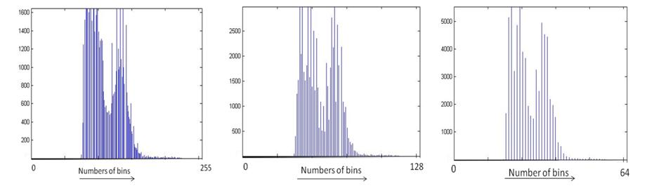

Given an image A, its histogram H(k) is derived by counting the number of pixels at every grey level k.

H(k) = Nk k = 0,1,2.....K-1.

where Nk is the count of pixels at gray level k. The total number of bins in this histogram is K . Theoretically, the maximum value for K is determined by the pixel depth M of the image. For instance, for an M=8-bit greyscale image, we can have up to 2M = 256 = K bins and for a binary image (1-bit) we can have just 2 bins.

Sometimes, the value of K is chosen to be different from2M. This will alter the appearance of the histogram. The example below illustrates this effect.

The histogram of an image is a good indicator of the contrast and brightness of a given image.

|Image appearance|  	  Histogram    	      |
|----------------|----------------------------|
|Dark            |confined to low gray levels |
|Bright          |confined to high gray levels|
|Poor contrast   |narrow                      |
|High contrast   |wide with good spread       |

This property of a histogram is used in content-based retrieval applications to roughly categorise images. Other uses for image histograms are to quantitatively describe an image via its pixel statistics: mean value (intensity), median value, standard deviation and the number of modes.

These information in turn are useful for processing a given image to enhance or analyse the content of the image which is described in detail next.

**Histogram Processing:**

The contrast of an image can be modified by manipulating its histogram. A popular method is via Histogram equalization. Here, the given histogram is manipulated such that the distribution of pixel values is evenly spread over the entire range 0 to K-1.

Histogram equalization can be done at a global or local level. In the global level the histogram of the entire image is processed whereas at the local level, the given image is subdivided and the histograms of the subdivisions (or subimages) are manipulated individually. When histogram equalization is applied locally, the procedure is called *Adaptive Histogram Equalization*.